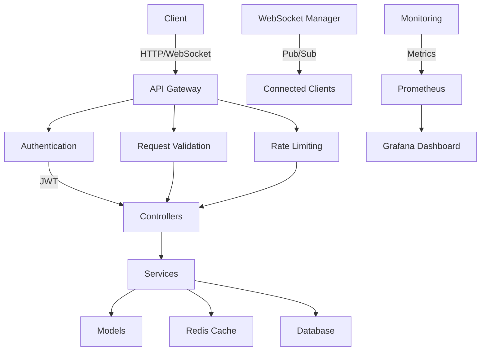

# PetStore API Architecture

## System Overview

The PetStore API is a modern, WebSocket-based implementation of the PetStore API built with TypeScript, Fastify, and WebSockets. It follows a modular, plugin-based architecture designed for scalability, maintainability, and performance.

## High-Level Architecture



## Core Components

### 1. API Layer

#### Fastify Server
- **Role**: HTTP/WebSocket server
- **Features**:
  - Plugin-based architecture
  - Request/Response validation
  - Built-in JSON schema validation
  - WebSocket support

#### Routes
- **Authentication**: JWT-based auth endpoints
- **Pets**: CRUD operations for pet resources
- **Store**: Order management
- **Users**: User account management
- **Health**: System health checks
- **Metrics**: Prometheus metrics endpoint

### 2. Authentication & Authorization

#### JWT Authentication
- Token-based authentication
- Role-based access control (RBAC)
- Token refresh mechanism
- Session management with Redis

#### Security
- Rate limiting
- Request validation
- CORS protection
- CSRF protection
- Helmet.js for security headers

### 3. Business Logic

#### Controllers
- Handle HTTP requests
- Request/response transformation
- Error handling
- Input validation

#### Services
- Business logic implementation
- Data validation
- Transaction management
- Integration with external services

### 4. Data Layer

#### Models
- Data structure definitions
- Validation rules
- Business rules
- Relationships

#### Repositories
- Data access abstraction
- Database operations
- Caching layer
- Query building

### 5. Real-time Features

#### WebSocket Server
- Real-time updates
- Event broadcasting
- Connection management
- Room/Channel support

#### Pub/Sub System
- Redis-based pub/sub
- Event-driven architecture
- Message queuing
- Event sourcing

### 6. Monitoring & Observability

#### Logging
- Structured logging
- Request/response logging
- Error logging
- Audit logging

#### Metrics
- Prometheus metrics
- Custom business metrics
- System metrics
- Alerting rules

#### Tracing
- Distributed tracing
- Performance monitoring
- Error tracking
- Dependency tracking

## Data Flow

1. **HTTP Request Flow**:
   ```
   Client → API Gateway → Middleware → Route Handler → Controller → Service → Repository → Database
   ```

2. **WebSocket Message Flow**:
   ```
   Client → WebSocket Server → Message Handler → Service → (Optional: Broadcast) → Other Clients
   ```

3. **Authentication Flow**:
   ```
   Client → Login Endpoint → JWT Generation → Token Returned → Token Storage (Client)
   ```

## Deployment Architecture

### Development
- Local development with hot-reload
- In-memory database
- Local Redis instance

### Staging/Production
- Containerized with Docker
- Orchestrated with Kubernetes
- Redis cluster for caching and pub/sub
- PostgreSQL for persistent storage
- Load balancer for horizontal scaling

## Performance Considerations

### Caching Strategy
- Redis caching layer
- Cache invalidation policies
- Distributed caching

### Database Optimization
- Indexing strategy
- Query optimization
- Connection pooling

### Scaling
- Horizontal scaling of stateless services
- Database read replicas
- Caching strategy

## Security Considerations

### Data Protection
- Encryption at rest
- Encryption in transit (TLS)
- Data masking
- Rate limiting

### Authentication
- JWT with short expiration
- Refresh tokens
- Secure token storage
- Token revocation

### API Security
- Input validation
- Output encoding
- Security headers
- CORS configuration

## Monitoring & Alerting

### Metrics Collection
- Prometheus for metrics collection
- Custom metrics for business logic
- System resource monitoring

### Logging
- Structured JSON logging
- Log aggregation
- Log retention policies

### Alerting
- Alert manager configuration
- Notification channels
- On-call rotation

## Future Improvements

1. **Feature Enhancements**
   - GraphQL API layer
   - Webhook support
   - File upload service
   - Advanced search capabilities

2. **Performance**
   - Query optimization
   - Caching improvements
   - Database sharding

3. **Scalability**
   - Service decomposition
   - Event sourcing
   - CQRS pattern

4. **Developer Experience**
   - Better documentation
   - SDK generation
   - API versioning

## Dependencies

### Core Dependencies
- Fastify: Web framework
- TypeScript: Type checking
- WebSocket: Real-time communication
- Redis: Caching and pub/sub
- PostgreSQL: Primary database

### Development Dependencies
- Jest: Testing framework
- ESLint: Code linting
- Prettier: Code formatting
- TypeORM: Database ORM

## Conclusion

This architecture provides a solid foundation for building scalable, maintainable, and performant APIs with real-time capabilities. The modular design allows for easy extension and maintenance, while the focus on observability ensures that the system remains reliable in production environments.
