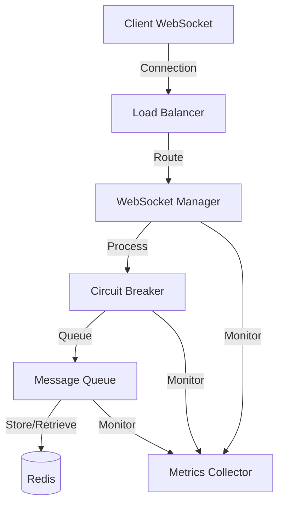
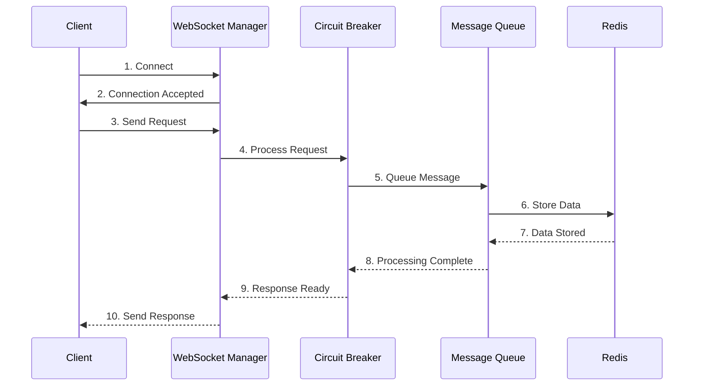
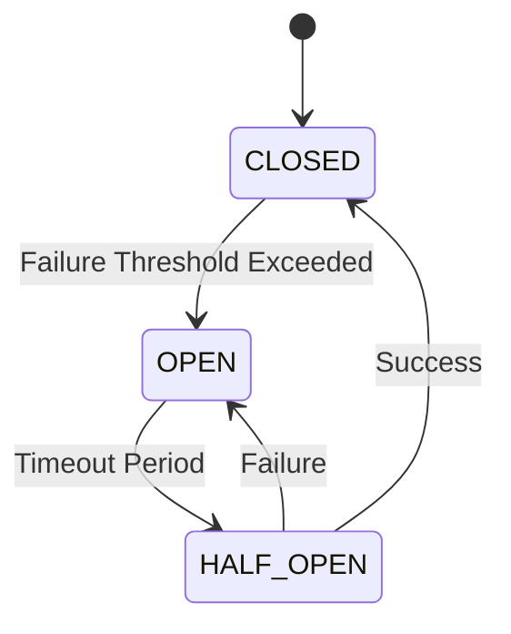
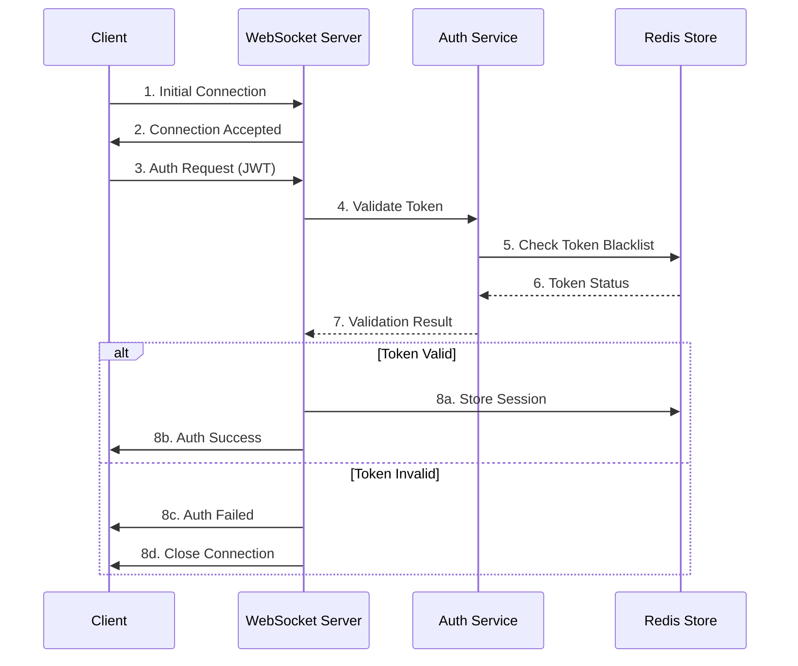
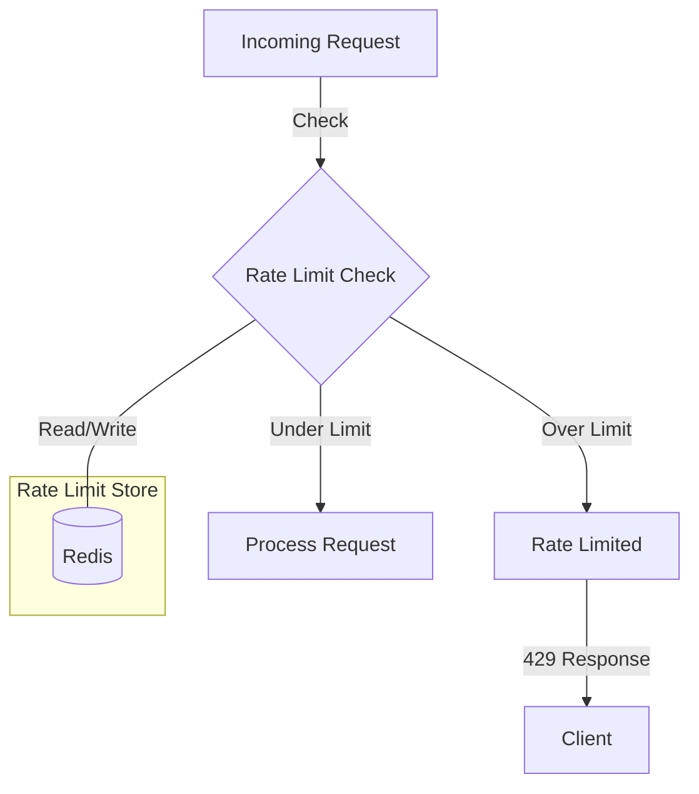
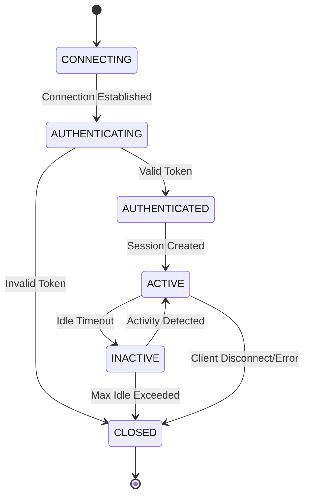
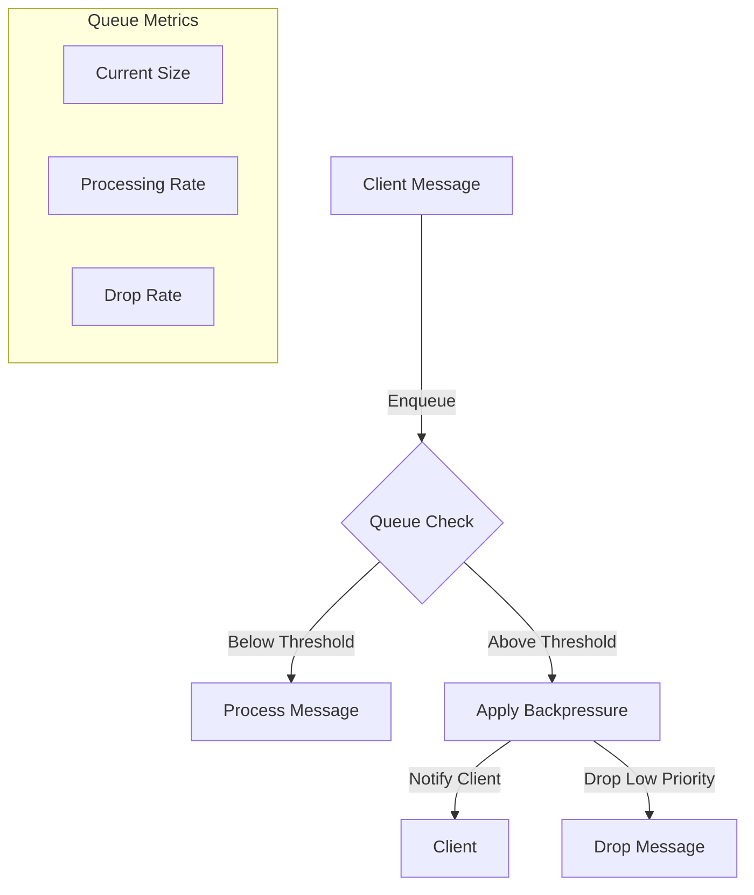

# WebSocket-based Pet Store API

A robust WebSocket-based API implementation for a pet store, built with TypeScript, ESM, and modern best practices.

---

**2025 Update: ESM & TypeScript Compatibility**

- This project is fully ESM-native and uses TypeScript with `module: nodenext`.
- All import paths use explicit `.ts` extensions in source and test files for compatibility with Node.js ESM loader and ts-node/jest.
- Dynamic imports (e.g., plugins) must use `.ts` extensions in source and test mode.
- Node.js >= 18 is required for ESM and fetch API support.
- TypeScript 5.1.x is recommended for best compatibility with ESLint tooling.

---

## Features

- **WebSocket Communication**
  - Type-safe message schemas using Zod
  - Request-response correlation with IDs
  - Request timeout handling
  - Message routing

- **Security**
  - Token-based authentication
  - IP-based rate limiting
  - Origin validation
  - Role-based authorization
  - Connection limits per IP

- **Scalability**
  - Load balancer with multiple distribution strategies
  - Node health monitoring
  - Dynamic node management
  - Connection statistics tracking

- **Reliability**
  - Circuit breaker pattern
  - Failure detection and isolation
  - Automatic recovery mechanisms
  - State management (CLOSED, OPEN, HALF-OPEN)
  - Fallback operations

- **Performance Monitoring**
  - Prometheus metrics integration
  - Grafana dashboards
  - Latency tracking and histograms
  - Error rate monitoring
  - Real-time metrics collection

- **Message Queue System**
  - Priority-based queuing
  - Backpressure handling
  - Retry mechanisms
  - Concurrent processing
  - Queue monitoring

- **Clustering Support**
  - Redis-based coordination
  - Node discovery
  - Health monitoring
  - Load distribution
  - Cluster-wide broadcasting

## Prerequisites

- Node.js >= 18
- Redis
- Docker and Docker Compose (for containerized deployment)

## Installation

1. Clone the repository:
```bash
# Use your fork or the main repo
 git clone https://github.com/yourusername/petstore-typescript-mcp-ws.git
 cd petstore-typescript-mcp-ws
```

2. Install dependencies:
```bash
npm install
```

3. Create a `.env` file:
```bash
cp .env.example .env
```

4. Build the project:
```bash
npm run build
```

> **Note:** If you encounter TypeScript/ESLint warnings about version compatibility, use TypeScript 5.1.x for best results.

## Development

Start the development server with hot reloading:
```bash
npm run dev
```

Run all tests:
```bash
npm test
```

Run linting:
```bash
npm run lint
```

Format code:
```bash
npm run format
```

Build the project:
```bash
npm run build
```

> **Tip:** All npm scripts are ESM/TypeScript compatible. Use `.ts` extensions in imports for all source and test files.

## Docker Deployment

Build and start the containers:
```bash
npm run docker:build
npm run docker:up
```

Stop the containers:
```bash
npm run docker:down
```

## Monitoring

The application exposes metrics at `/metrics` for Prometheus to scrape. Grafana dashboards are available at port 3000.

Default Grafana credentials:
- Username: admin
- Password: admin

## Monitoring & Metrics

- The `/metrics` endpoint exposes Prometheus-compatible metrics, including Node.js process, WebSocket, and API health metrics.
- **Custom metrics include:**
  - WebSocket connections (current/total, by status)
  - WebSocket messages (by type/status), errors, and latency histograms
  - Rate limiting and authentication attempts (with labels)
  - Circuit breaker state, load balancer nodes/latency, queue size/processing time
  - System metrics: CPU load (1m/5m/15m), memory usage (heap, RSS, external)
- **Extending metrics:**
  1. Define new metrics in `src/monitoring/metrics.ts` and register with the shared registry.
  2. Add/extend tests in `src/__tests__/monitoring/metrics.test.ts` to cover all label combinations, buckets, and error/edge cases.
  3. Ensure helper functions and error handling are tested (see file-level doc comment in `metrics.test.ts`).
- **Testing:**
  - All metrics logic is covered by robust unit tests, including error/edge cases and resource cleanup.
  - To run metrics tests: `npm test -- src/__tests__/monitoring/metrics.test.ts --coverage`
- **Production monitoring:**
  - Prometheus scrapes `/metrics` for dashboards and alerting (see `grafana/dashboards/` for examples).
  - System metric collection is resilient to restricted environments (errors are caught and ignored).

### Metrics Flow Diagram

```mermaid
graph TD
    A[WebSocket Events / System Events] --> B[Metrics Helpers\n(updateConnectionMetrics, updateSystemMetrics, etc.)]
    B --> C[Prometheus Metrics Registry]
    C --> D[/metrics Endpoint]
    D --> E[Prometheus Server]
    E --> F[Grafana Dashboards]
    C -->|Test/Mock| G[Unit/Integration Tests]
    B -->|Error Handling| H[Error Logging]
```

This diagram shows how metrics are updated in response to WebSocket and system events, registered with the Prometheus registry, and exposed via the `/metrics` endpoint for Prometheus and Grafana. Tests and error handling are integrated into the flow.

## Testing & Reliability

- All integration and unit tests are run with Jest and ts-jest in ESM mode.
- Tests import source files using `.ts` extensions and expect ESM compatibility.
- The test suite covers health checks, metrics, WebSocket protocols, and circuit breaker logic.
- If you see coverage warnings, check the Jest output for details. All tests must pass for CI.

## Architecture

### System Overview



### Message Flow Sequence



### State Management



## WebSocket API Documentation

### Message Format

All WebSocket messages follow a standardized format with type-safe schemas using Zod:

#### Base Message Structure
```typescript
{
  type: 'request' | 'response' | 'notification',
  correlationId: string, // UUID
  timestamp: number
}
```

#### Request Messages
```typescript
{
  type: 'request',
  correlationId: string,
  timestamp: number,
  action: string,
  payload: unknown
}
```

#### Response Messages
```typescript
{
  type: 'response',
  correlationId: string,
  timestamp: number,
  status: 'success' | 'error',
  payload: unknown
}
```

#### Notification Messages
```typescript
{
  type: 'notification',
  correlationId: string,
  timestamp: number,
  event: string,
  payload: unknown
}
```

### Common Message Flows

#### Authentication Flow
1. Connect to WebSocket server
2. Send authentication request:
```typescript
{
  type: 'request',
  correlationId: '123e4567-e89b-12d3-a456-426614174000',
  timestamp: 1634567890123,
  action: 'authenticate',
  payload: {
    token: 'your-jwt-token'
  }
}
```
3. Receive authentication response:
```typescript
{
  type: 'response',
  correlationId: '123e4567-e89b-12d3-a456-426614174000',
  timestamp: 1634567890124,
  status: 'success',
  payload: {
    userId: '12345',
    permissions: ['read', 'write']
  }
}
```

#### Error Handling
The system includes built-in error types:
- `WebSocketTimeoutError`: Thrown when a request exceeds the timeout period
- `WebSocketValidationError`: Thrown when message validation fails

Example error response:
```typescript
{
  type: 'response',
  correlationId: '123e4567-e89b-12d3-a456-426614174000',
  timestamp: 1634567890125,
  status: 'error',
  payload: {
    code: 'VALIDATION_ERROR',
    message: 'Invalid message format'
  }
}
```

### WebSocket Events

| Event | Description | Payload Example |
|-------|-------------|----------------|
| `connect` | Client connection established | `{ clientId: string }` |
| `disconnect` | Client disconnected | `{ reason: string }` |
| `error` | Error occurred | `{ code: string, message: string }` |
| `ping` | Health check | `{ timestamp: number }` |

### Rate Limiting

- Maximum connections per IP: 10
- Message rate limit: 100 messages per minute
- Burst allowance: 20 messages

### Best Practices

1. **Connection Management**
   - Implement exponential backoff for reconnection attempts
   - Handle connection timeouts gracefully
   - Monitor connection health with ping/pong

2. **Message Handling**
   - Always include a `correlationId` for request-response pairs
   - Validate message schemas before processing
   - Implement timeout handling for requests

3. **Error Handling**
   - Log all errors with appropriate context
   - Implement proper error recovery mechanisms
   - Use appropriate error types

## API Documentation

### WebSocket Events

-

## Security

### Authentication and Authorization



### Security Features

#### Token-Based Authentication
- **JWT Token Structure**
  ```typescript
  {
    header: {
      alg: 'RS256',
      typ: 'JWT'
    },
    payload: {
      sub: string,      // User ID
      exp: number,      // Expiration timestamp
      iat: number,      // Issued at timestamp
      roles: string[],  // User roles
      perms: string[]   // User permissions
    }
  }
  ```
- Token rotation every 24 hours
- Automatic token refresh mechanism
- Token blacklisting for revoked access

#### Rate Limiting Implementation


- **Rate Limit Configuration**
  ```typescript
  interface RateLimitConfig {
    windowMs: 60000,           // 1 minute window
    maxRequests: 100,         // requests per window
    burstLimit: 20,          // burst allowance
    ipWhitelist: string[],   // exempt IPs
    errorCode: 429,         // too many requests
    keyPrefix: 'rl:'       // Redis key prefix
  }
  ```

#### Connection Security
- TLS/WSS required for all connections
- Origin validation with configurable allowlist
- IP-based connection limiting
- Automatic connection termination for inactive clients

#### Data Validation
- Schema validation using Zod for all messages
- Payload size limits
- Input sanitization
- Type safety enforcement

### WebSocket Connection Lifecycle



### WebSocket Message Handling

#### Message Queue Priority Levels
```typescript
enum MessagePriority {
  CRITICAL = 0,   // System messages, authentication
  HIGH = 1,       // User actions, transactions
  NORMAL = 2,     // Regular updates, queries
  LOW = 3,        // Bulk operations, analytics
  BACKGROUND = 4  // Maintenance tasks
}
```

#### Backpressure Handling


### Security Best Practices

1. **Connection Management**
   - Implement connection pooling
   - Set appropriate timeouts
   - Monitor connection states
   - Handle reconnection with exponential backoff

2. **Message Security**
   - Encrypt sensitive data
   - Validate message integrity
   - Implement message acknowledgment
   - Handle message replay protection

3. **Error Handling and Logging**
   - Log security events
   - Monitor failed authentication attempts
   - Track rate limit violations
   - Alert on suspicious patterns

4. **Session Management**
   ```typescript
   interface SessionConfig {
     maxAge: 3600000,        // 1 hour
     inactiveTimeout: 300000, // 5 minutes
     renewThreshold: 600000,  // 10 minutes
     cleanupInterval: 60000   // 1 minute
   }
   ```

### Monitoring and Alerts

#### Security Metrics
| Metric | Description | Alert Threshold |
|--------|-------------|-----------------|
| `auth_failures` | Failed authentication attempts | >10/minute |
| `rate_limits` | Rate limit violations | >100/hour |
| `invalid_messages` | Message validation failures | >50/minute |
| `connection_drops` | Abnormal connection terminations | >20/minute |

#### Health Checks
```typescript
interface HealthCheck {
  redis: {
    status: 'up' | 'down',
    latency: number
  },
  messageQueue: {
    size: number,
    processRate: number
  },
  connections: {
    active: number,
    authenticated: number
  }
}
```

## Diagram Validation

A script is provided to automatically validate all Mermaid diagrams in the README and documentation files. This ensures diagrams are syntactically correct and renderable in CI and documentation tools.

### How to Run Diagram Validation

1. **Install mermaid-cli (mmdc):**
   ```bash
   npm install -g @mermaid-js/mermaid-cli
   ```
2. **Run the validation script:**
   ```bash
   npx mmdc -i README.md -o /tmp/diagram.svg --quiet || (echo "Mermaid diagram validation failed" && exit 1)
   ```
   - This will parse all Mermaid code blocks in `README.md` and attempt to render them. If any diagram is invalid, the command will fail.
   - You can adapt this for other markdown files as needed.

3. **CI Integration:**
   - Add the above command to your CI pipeline (e.g., GitHub Actions, GitLab CI) to ensure all Mermaid diagrams are always valid.

### Example GitHub Actions Step
```yaml
- name: Validate Mermaid diagrams
  run: |
    npm install -g @mermaid-js/mermaid-cli
    npx mmdc -i README.md -o /tmp/diagram.svg --quiet
```

> **Tip:** For multi-file validation, use a glob or loop over all markdown files.

## Automated Endpoint Health Checks

A script is provided to automatically build, start, and check the health and key endpoints of the server. This ensures that `/health`, `/metrics`, `/`, and `/pets` endpoints are always tested for availability and correctness.

### How to Run Endpoint Health Checks

1. **Run the script:**
   ```bash
   ./health-and-endpoints-check.sh
   ```
   - This will build the project, start the server in the background, check all key endpoints, print their responses, and then stop the server.

2. **CI Integration:**
   - Add the following step to your GitHub Actions workflow after the build step:

```yaml
- name: Automated Endpoint Health Checks
  run: |
    chmod +x health-and-endpoints-check.sh
    ./health-and-endpoints-check.sh
```

> **Tip:** You can add or modify endpoints to check by editing the `health-and-endpoints-check.sh` script.
